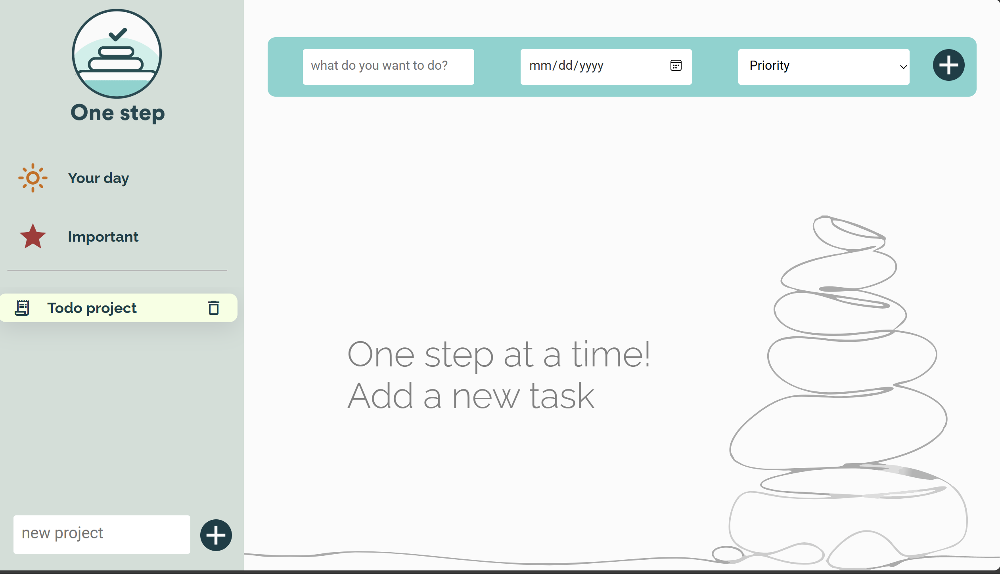
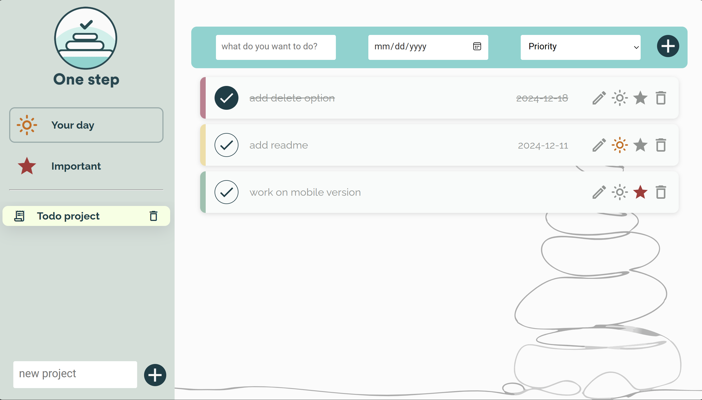

# OneStep

This project is **OneStep**, a To-Do App built using **JavaScript**, created as part of **The Odin Project**. It features project-based task organization and special sections for daily tasks and important tasks. The app's **calming and minimalist UI** is designed to provide a stress-free environment for managing your tasks effectively. Through this project, I deepened my understanding of **ES6 modules**, **classes**, **local storage**, **npm**, and **webpack**.


---

## Screenshots




## Features

This project was an opportunity to:

- **Implement ES6 Modules**: Organized the codebase into reusable and maintainable modules.
- **Work with Classes**: Used classes to encapsulate project and task logic.
- **Local Storage**: Learned to store and retrieve user data efficiently.
- **npm**: Managed dependencies and streamlined the development process.
- **Webpack**: Bundled modules and optimized assets for better performance.
- **Event Listeners**: Managed user interactions dynamically with JavaScript.
- **Dynamic DOM Manipulation**: Updated the user interface in response to changes in the data

---

## Technologies Used

- **JavaScript (ES6)**: For modular and class-based structure.
- **npm**: For managing project dependencies.
- **Webpack**: To bundle modules and assets efficiently.
- **CSS**: To style the app and provide a visually appealing interface.
- **HTML5**: Markup for the app layout.
- **Local Storage**: For persisting user data across sessions.

---

## What I Learned

This project was an opportunity to:

- **Implement ES6 Modules**: Organized the codebase into reusable and maintainable modules.
- **Work with Classes**: Used classes to encapsulate project and task logic.
- **Local Storage**: Learned to store and retrieve user data efficiently.
- **Event Listeners**: Managed user interactions dynamically with JavaScript.
- **Dynamic DOM Manipulation**: Updated the user interface in response to changes in the data.

---

## How to Use

1. Clone this repository:
   ```bash
   git clone https://hafm919.github.io/odin-onestep/
   ```
2. Navigate to the project directory:
   ```bash
   cd odin-onestep
   ```
3. Install dependencies:
   ```bash
   npm install
   ```
4. Start the development server:
   ```bash
   npm run dev
   ```
5. Alternatively, view the live version of the application at: [Live Demo](https://your-live-link.com)

---

## Future Improvements

- **Drag-and-Drop Feature**: Allow reordering of tasks within projects.
- **Due Date Notifications**: Add reminders for approaching deadlines.
- **Task Filters**: Include filtering options based on tags or priority levels.
- **Enhanced UI**: Improve the visual design with animations and better accessibility.
- **Sync Across Devices**: Enable cloud storage for seamless synchronization.

---

---

## Feedback and Contributions

I’m constantly looking to improve! If you have feedback or ideas, feel free to reach out or open an issue on the GitHub repository.

---

## Acknowledgments

- The Odin Project for its structured curriculum.
